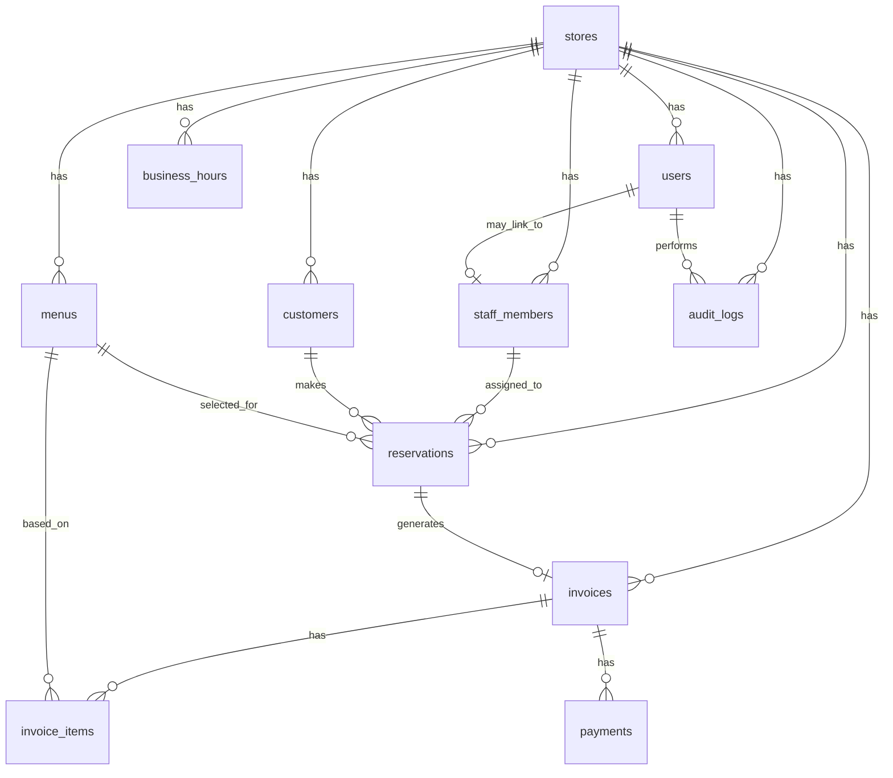

# 初期ER図・データモデル設計

## 1. 目的

本ドキュメントは、Reserve CRM のMVPにおける初期データモデルを定義することを目的とする。

MVPでは、以下の業務フローを実現するために必要なデータ構造を設計する。

```text
顧客登録
↓
予約登録
↓
予約変更・キャンセル
↓
来店済み
↓
請求作成
↓
支払い済み登録
↓
売上確認
```

本ドキュメントは初期設計であり、詳細なカラム定義や制約は後続のテーブル定義書で確定する。

---

## 2. データ設計方針

### 2.1 MVPでは1店舗を対象とする

MVPでは1店舗運営の小規模サロンを対象とする。

ただし、将来的な複数店舗対応を見据えて、主要テーブルには `store_id` を持たせる方針とする。

### 2.2 削除は原則として論理削除にする

顧客、スタッフ、メニュー、予約、請求などの業務データは、原則として物理削除しない。

削除または無効化が必要な場合は、以下のようなカラムで管理する。

* `is_active`
* `deleted_at`

理由は、過去の予約履歴、請求履歴、売上集計との整合性を保つためである。

### 2.3 金額は整数で管理する

金額は小数ではなく、円単位の整数で管理する。

例：

```text
5,500円 → 5500
```

### 2.4 日時はUTCで保存する

日時はDB上ではUTCで保存し、画面表示時に店舗のタイムゾーンへ変換する。

MVPでは店舗タイムゾーンを `Asia/Tokyo` とする。

### 2.5 予約重複は重要な業務制約として扱う

予約重複防止はMVPの重要要件である。

同じ店舗、同じスタッフ、同じ時間帯に、有効な予約が重ならないように制御する。

MVPではアプリケーション層で重複チェックを行い、可能であればDBレベルでも制約またはトランザクション内再チェックを行う。

---

## 3. 主要エンティティ一覧

| エンティティ         | 内容       |
| -------------- | -------- |
| stores         | 店舗情報     |
| users          | ログインユーザー |
| staff_members  | 予約担当スタッフ |
| menus          | 施術メニュー   |
| customers      | 顧客情報     |
| reservations   | 予約情報     |
| invoices       | 請求情報     |
| invoice_items  | 請求明細     |
| payments       | 支払い情報    |
| audit_logs     | 操作ログ     |
| business_hours | 営業時間     |

---

## 4. 初期ER図



---

## 5. テーブル概要

# 5.1 stores

店舗情報を管理する。

MVPでは1店舗のみを想定するが、将来的な複数店舗対応に備えて定義する。

## 主なカラム

| カラム        | 型        | 内容     |
| ---------- | -------- | ------ |
| id         | UUID     | 店舗ID   |
| name       | string   | 店舗名    |
| timezone   | string   | タイムゾーン |
| created_at | datetime | 作成日時   |
| updated_at | datetime | 更新日時   |

## 備考

MVPでは `timezone` の初期値を `Asia/Tokyo` とする。

---

# 5.2 users

ログインユーザーを管理する。

オーナーやスタッフがシステムにログインするためのアカウント情報を保持する。

## 主なカラム

| カラム           | 型             | 内容        |
| ------------- | ------------- | --------- |
| id            | UUID          | ユーザーID    |
| store_id      | UUID          | 店舗ID      |
| name          | string        | ユーザー名     |
| email         | string        | メールアドレス   |
| password_hash | string        | パスワードハッシュ |
| role          | enum          | 役割        |
| is_active     | boolean       | 有効状態      |
| created_at    | datetime      | 作成日時      |
| updated_at    | datetime      | 更新日時      |
| deleted_at    | datetime/null | 論理削除日時    |

## role

| 値     | 意味   |
| ----- | ---- |
| owner | オーナー |
| staff | スタッフ |

## 制約

* `email` は店舗内で一意
* `password_hash` には平文パスワードを保存しない
* `is_active = false` のユーザーはログイン不可

---

# 5.3 staff_members

予約担当者としてのスタッフ情報を管理する。

ログインユーザーとスタッフは似ているが、将来的に「ログインしない施術スタッフ」もあり得るため、`users` とは分ける。

## 主なカラム

| カラム        | 型             | 内容        |
| ---------- | ------------- | --------- |
| id         | UUID          | スタッフID    |
| store_id   | UUID          | 店舗ID      |
| user_id    | UUID/null     | 紐づくユーザーID |
| name       | string        | スタッフ名     |
| email      | string/null   | メールアドレス   |
| role       | enum          | 店舗内の役割    |
| is_active  | boolean       | 有効状態      |
| created_at | datetime      | 作成日時      |
| updated_at | datetime      | 更新日時      |
| deleted_at | datetime/null | 論理削除日時    |

## 備考

* 新規予約時は `is_active = true` のスタッフのみ選択可能
* 過去の予約には無効化済みスタッフも表示する
* `user_id` は nullable とする

---

# 5.4 menus

施術メニューを管理する。

予約時の所要時間計算と、請求作成時の金額計算に使用する。

## 主なカラム

| カラム              | 型             | 内容     |
| ---------------- | ------------- | ------ |
| id               | UUID          | メニューID |
| store_id         | UUID          | 店舗ID   |
| name             | string        | メニュー名  |
| duration_minutes | integer       | 所要時間   |
| price            | integer       | 料金     |
| is_active        | boolean       | 有効状態   |
| created_at       | datetime      | 作成日時   |
| updated_at       | datetime      | 更新日時   |
| deleted_at       | datetime/null | 論理削除日時 |

## 制約

* `duration_minutes` は1以上
* `price` は0以上
* 新規予約時は `is_active = true` のメニューのみ選択可能

---

# 5.5 customers

顧客情報を管理する。

顧客の基本情報、連絡先、メモ、注意事項を保持する。

## 主なカラム

| カラム            | 型             | 内容      |
| -------------- | ------------- | ------- |
| id             | UUID          | 顧客ID    |
| store_id       | UUID          | 店舗ID    |
| full_name      | string        | 氏名      |
| full_name_kana | string/null   | フリガナ    |
| phone          | string/null   | 電話番号    |
| email          | string/null   | メールアドレス |
| birthday       | date/null     | 生年月日    |
| memo           | text/null     | メモ      |
| note           | text/null     | 注意事項    |
| first_visit_at | datetime/null | 初回来店日時  |
| last_visit_at  | datetime/null | 最終来店日時  |
| created_at     | datetime      | 作成日時    |
| updated_at     | datetime      | 更新日時    |
| deleted_at     | datetime/null | 論理削除日時  |

## 備考

* 顧客検索では `full_name`, `full_name_kana`, `phone` を対象とする
* 電話番号の完全一致で重複候補を検出する
* MVPでは電話番号の重複を禁止まではせず、警告表示とする

---

# 5.6 reservations

予約情報を管理する。

Reserve CRM の中心となるテーブルである。

## 主なカラム

| カラム             | 型             | 内容        |
| --------------- | ------------- | --------- |
| id              | UUID          | 予約ID      |
| store_id        | UUID          | 店舗ID      |
| customer_id     | UUID          | 顧客ID      |
| staff_member_id | UUID          | 担当スタッフID  |
| menu_id         | UUID          | メニューID    |
| start_at        | datetime      | 予約開始日時    |
| end_at          | datetime      | 予約終了日時    |
| status          | enum          | 予約ステータス   |
| note            | text/null     | 備考        |
| created_by      | UUID/null     | 作成者ユーザーID |
| updated_by      | UUID/null     | 更新者ユーザーID |
| created_at      | datetime      | 作成日時      |
| updated_at      | datetime      | 更新日時      |
| deleted_at      | datetime/null | 論理削除日時    |

## status

| 値         | 意味      |
| --------- | ------- |
| reserved  | 予約済み    |
| visited   | 来店済み    |
| cancelled | キャンセル   |
| no_show   | 無断キャンセル |

## 予約重複判定

同じ店舗、同じスタッフで、以下の条件を満たす予約が存在する場合は重複とみなす。

```text
既存予約.start_at < 新規予約.end_at
AND
新規予約.start_at < 既存予約.end_at
```

ただし、以下の予約は重複判定の対象外とする。

* `status = cancelled`
* `deleted_at IS NOT NULL`

## 制約

* `start_at < end_at`
* `customer_id` は必須
* `staff_member_id` は必須
* `menu_id` は必須

---

# 5.7 invoices

請求情報を管理する。

MVPでは、来店済み予約から1つの請求を作成する想定とする。

## 主なカラム

| カラム            | 型             | 内容        |
| -------------- | ------------- | --------- |
| id             | UUID          | 請求ID      |
| store_id       | UUID          | 店舗ID      |
| reservation_id | UUID          | 予約ID      |
| customer_id    | UUID          | 顧客ID      |
| status         | enum          | 請求ステータス   |
| total_amount   | integer       | 請求合計金額    |
| issued_at      | datetime      | 請求作成日時    |
| created_by     | UUID/null     | 作成者ユーザーID |
| created_at     | datetime      | 作成日時      |
| updated_at     | datetime      | 更新日時      |
| deleted_at     | datetime/null | 論理削除日時    |

## status

| 値         | 意味    |
| --------- | ----- |
| unpaid    | 未払い   |
| paid      | 支払い済み |
| cancelled | キャンセル |

## 制約

* `reservation_id` は原則一意
* `total_amount` は0以上
* 支払い済み請求のみ売上集計対象とする

---

# 5.8 invoice_items

請求明細を管理する。

MVPでは、予約に紐づくメニューを請求明細として登録する。

## 主なカラム

| カラム         | 型         | 内容     |
| ----------- | --------- | ------ |
| id          | UUID      | 請求明細ID |
| invoice_id  | UUID      | 請求ID   |
| menu_id     | UUID/null | メニューID |
| description | string    | 明細名    |
| quantity    | integer   | 数量     |
| unit_price  | integer   | 単価     |
| amount      | integer   | 金額     |
| created_at  | datetime  | 作成日時   |
| updated_at  | datetime  | 更新日時   |

## 備考

`description` と `unit_price` は請求作成時点の情報を保持する。

理由は、後からメニュー名や料金が変更されても、過去の請求金額が変わらないようにするためである。

---

# 5.9 payments

支払い情報を管理する。

MVPでは、1つの請求に対して1回の支払いを想定する。

将来的には分割支払いや一部入金に対応できるよう、請求とは別テーブルにする。

## 主なカラム

| カラム            | 型         | 内容        |
| -------------- | --------- | --------- |
| id             | UUID      | 支払いID     |
| invoice_id     | UUID      | 請求ID      |
| amount         | integer   | 支払い金額     |
| payment_method | enum      | 支払い方法     |
| paid_at        | datetime  | 支払い日時     |
| created_by     | UUID/null | 登録者ユーザーID |
| created_at     | datetime  | 作成日時      |
| updated_at     | datetime  | 更新日時      |

## payment_method

| 値             | 意味       |
| ------------- | -------- |
| cash          | 現金       |
| credit_card   | クレジットカード |
| qr            | QR決済     |
| bank_transfer | 銀行振込     |
| other         | その他      |

## 備考

MVPでは決済処理そのものは行わない。
支払い方法と支払い済み状態の記録のみを行う。

---

# 5.10 business_hours

店舗の営業時間を管理する。

MVPでは、曜日ごとの営業時間を簡易的に管理する。

## 主なカラム

| カラム         | 型         | 内容     |
| ----------- | --------- | ------ |
| id          | UUID      | 営業時間ID |
| store_id    | UUID      | 店舗ID   |
| day_of_week | integer   | 曜日     |
| open_time   | time/null | 開店時刻   |
| close_time  | time/null | 閉店時刻   |
| is_closed   | boolean   | 定休日フラグ |
| created_at  | datetime  | 作成日時   |
| updated_at  | datetime  | 更新日時   |

## day_of_week

|  値 | 意味  |
| -: | --- |
|  0 | 日曜日 |
|  1 | 月曜日 |
|  2 | 火曜日 |
|  3 | 水曜日 |
|  4 | 木曜日 |
|  5 | 金曜日 |
|  6 | 土曜日 |

## 備考

* `is_closed = true` の日は予約不可
* 営業時間外の予約登録は不可
* スタッフ別シフト管理はMVP対象外

---

# 5.11 audit_logs

重要操作の履歴を管理する。

MVPでは、最低限の操作ログを記録する。

## 主なカラム

| カラム         | 型         | 内容        |
| ----------- | --------- | --------- |
| id          | UUID      | 操作ログID    |
| store_id    | UUID      | 店舗ID      |
| user_id     | UUID/null | 操作者ユーザーID |
| action      | string    | 操作種別      |
| target_type | string    | 対象種別      |
| target_id   | UUID/null | 対象ID      |
| detail      | json/null | 操作詳細      |
| created_at  | datetime  | 作成日時      |

## 記録対象の例

* 予約作成
* 予約変更
* 予約キャンセル
* 請求作成
* 支払い済み登録
* 顧客情報更新

---

## 6. 主要リレーション

# 6.1 店舗と各データ

`stores` は、以下のデータを持つ。

* users
* staff_members
* menus
* customers
* reservations
* invoices
* business_hours
* audit_logs

ほぼすべての業務データに `store_id` を持たせることで、将来的な複数店舗対応をしやすくする。

---

# 6.2 顧客と予約

1人の顧客は複数の予約を持つ。

```text
customers 1 - N reservations
```

予約履歴は、顧客詳細画面で表示する。

---

# 6.3 スタッフと予約

1人のスタッフは複数の予約を担当する。

```text
staff_members 1 - N reservations
```

予約重複チェックでは、`staff_member_id`, `start_at`, `end_at`, `status` を使用する。

---

# 6.4 メニューと予約

1つの予約には1つのメニューを紐づける。

```text
menus 1 - N reservations
```

MVPでは複数メニューを1予約に含める機能は対象外とする。

将来的に複数メニュー対応が必要になった場合は、`reservation_items` の追加を検討する。

---

# 6.5 予約と請求

MVPでは、1つの予約から1つの請求を作成する。

```text
reservations 1 - 0..1 invoices
```

請求作成は、予約ステータスが `visited` の場合に行える。

---

# 6.6 請求と請求明細

1つの請求は複数の請求明細を持てる。

```text
invoices 1 - N invoice_items
```

MVPでは主に1明細を想定するが、将来的な追加料金や割引に備えて明細テーブルを分ける。

---

# 6.7 請求と支払い

1つの請求は支払い情報を持つ。

```text
invoices 1 - N payments
```

MVPでは1請求1支払いを想定するが、将来的な一部入金や分割支払いに備えて `payments` を別テーブルにする。

---

## 7. 初期インデックス方針

MVPで想定する主な検索・参照に対して、以下のインデックスを検討する。

| テーブル         | カラム                                         | 目的            |
| ------------ | ------------------------------------------- | ------------- |
| users        | store_id, email                             | ログイン時のユーザー検索  |
| customers    | store_id, full_name                         | 顧客名検索         |
| customers    | store_id, full_name_kana                    | フリガナ検索        |
| customers    | store_id, phone                             | 電話番号検索・重複候補検出 |
| reservations | store_id, start_at                          | 日別予約一覧        |
| reservations | store_id, staff_member_id, start_at, end_at | 予約重複チェック      |
| reservations | store_id, customer_id                       | 顧客詳細の予約履歴     |
| invoices     | store_id, status                            | 請求一覧・未払い一覧    |
| invoices     | store_id, issued_at                         | 請求日検索         |
| payments     | invoice_id                                  | 請求詳細での支払い参照   |
| payments     | paid_at                                     | 売上集計          |

---

## 8. 主な業務ルール

# 8.1 予約登録

予約登録時は、以下をチェックする。

* 顧客が存在する
* スタッフが存在し、有効である
* メニューが存在し、有効である
* 開始日時が入力されている
* メニュー所要時間から終了日時を計算できる
* 開始日時が終了日時より前である
* 営業時間内である
* 同じスタッフの既存予約と重複しない

---

# 8.2 予約変更

予約変更時は、以下をチェックする。

* 予約が存在する
* キャンセル済み予約の変更可否を制御する
* 変更後の開始・終了日時が正しい
* 変更後の予約が他予約と重複しない
* 変更履歴を操作ログに記録する

---

# 8.3 予約キャンセル

予約キャンセル時は、以下を行う。

* 予約ステータスを `cancelled` に変更する
* 予約は物理削除しない
* キャンセル済み予約は重複判定から除外する
* 操作ログを記録する

---

# 8.4 請求作成

請求作成時は、以下をチェックする。

* 対象予約が存在する
* 予約ステータスが `visited` である
* 同じ予約に対する請求が未作成である
* メニュー料金をもとに請求明細を作成する
* 請求合計金額を計算する

---

# 8.5 支払い済み登録

支払い済み登録時は、以下を行う。

* 請求が存在する
* 請求ステータスが `unpaid` である
* 支払い方法が選択されている
* 支払い情報を作成する
* 請求ステータスを `paid` に変更する
* 支払い済み請求を売上集計対象にする

---

## 9. MVP後に検討するデータモデル

MVP後、以下の機能追加に応じてデータモデルを拡張する可能性がある。

| 機能        | 追加候補テーブル                    |
| --------- | --------------------------- |
| 複数メニュー予約  | reservation_items           |
| スタッフシフト管理 | staff_schedules             |
| キャンセル待ち   | waitlists                   |
| メール通知     | notifications               |
| 請求書PDF    | invoice_documents           |
| 顧客向けマイページ | customer_accounts           |
| 回数券管理     | tickets, ticket_usages      |
| クーポン管理    | coupons, coupon_redemptions |
| 複数店舗対応強化  | store_memberships           |
| 会計ソフト連携   | accounting_exports          |

---

## 10. 現時点の設計判断

| 判断                         | 理由                              |
| -------------------------- | ------------------------------- |
| users と staff_members を分ける | ログインユーザーと予約担当者を分離し、将来拡張しやすくするため |
| 主要テーブルに store_id を持たせる     | MVPは1店舗だが、将来的な複数店舗対応をしやすくするため   |
| invoice_items を用意する        | 将来的な追加料金・割引・複数明細に対応しやすくするため     |
| payments を invoices から分ける  | 将来的な分割支払い・複数支払いに対応しやすくするため      |
| 金額は integer で持つ            | 円単位の計算誤差を避けるため                  |
| 削除は論理削除を基本にする              | 過去の予約・請求・売上履歴との整合性を保つため         |
| 予約キャンセルは status で管理する      | 予約履歴を残しつつ、重複判定から除外するため          |

---

## 11. 未確定事項

以下は詳細設計時に確定する。

* 電話番号の正規化方法
* メールアドレスの一意制約範囲
* 顧客の物理削除を許可するか
* キャンセル済み予約の編集可否
* 請求キャンセル時の支払いデータの扱い
* 税率をMVPで扱うか
* 割引をMVPで扱うか
* 予約変更履歴を audit_logs のみで持つか、専用テーブルを作るか
* 予約重複防止をDB制約まで実装するか
